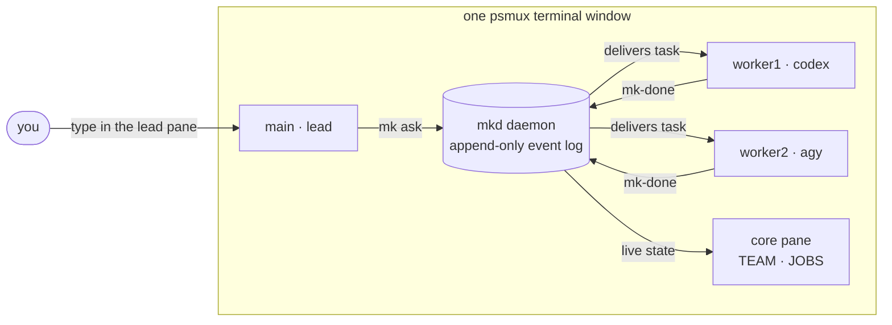

<div align="center">

# ⬢ MKCREW

### Your AI coding crew, in one Windows terminal.

Run a **team** of real agent CLIs — **Claude Code, Codex, opencode, Antigravity** — side by side in a
native-Windows cockpit. A **lead** delegates, **workers** build, and an event-sourced **control tower**
shows every job live.

[](#-install)
[](#-faq)
[](#-install)
[](#-install)
[](https://github.com/rayngnpc/psmux-mk)

**[Install](#-install)** · **[Quickstart](#-quickstart)** · **[How it works](#-how-it-works)** ·
**[Commands](#-commands)** · **[FAQ](#-faq)**

</div>

---

```text
┌────────────────────────┬─ MKCREW ⬢ myproject ────┬─────────────────────────┐
│                        │  worker1 · codex        │  worker2 · claude       │
│   main · claude        │  ready                  │  working: fix #12       │
│   (lead)               ├──────────────────────────┴─────────────────────────┤
│                        │  TEAM                     JOBS                     │
│   > mk ask worker2     │  ⬢ main     lead          ⏳ j42  fix the tests    │
│     "fix the tests"    │  ⬢ worker1  idle          ✔ j41  add coverage     │
│                        │  ⬢ worker2  busy          ✔ j40  refactor io      │
└────────────────────────┴────────────────────────────────────────────────────┘
```

Every pane is a **real, interactive CLI** — the same `claude` / `codex` you use every day, with your
existing logins and plans. No headless mode, no API keys, no SDK. MKCREW turns them into a crew.

## ✨ Why MKCREW

- 🪟 **Native Windows.** No WSL, no Docker, no Linux VM. Built on [psmux](https://github.com/psmux/psmux), a Windows tmux.
- 👥 **A real team, visible.** Up to 4 agents — a lead + 3 workers — each in its own pane. Watch them work, or jump into any pane and type.
- 📜 **Event-sourced.** Every delegation is an append-only event. The control tower (TEAM / JOBS) is rebuilt live from the log — kill the cockpit, relaunch, nothing is lost.
- 🔌 **Mix providers per pane.** Lead on Claude, workers on Codex + Antigravity? One dropdown each.
- 🖥️ **Studio GUI.** `mk studio` opens a browser cockpit-builder: pick a folder, team size, per-pane providers, a layout — save it as a profile, hit Launch.
- 🧰 **Zero-force installer.** Checks everything, asks before installing anything, never needs admin.

## 🚀 Install

**One command** (PowerShell, no clone, installs only what's missing — uv → Python → MKCREW → psmux):

```powershell
powershell -ExecutionPolicy Bypass -c "irm https://raw.githubusercontent.com/rayngnpc/mkcrew/main/install.ps1 | iex"
```

The installer is an arrow-key menu with three modes — **INSTALL** (confirms each item), **AUDIT**
(read-only report, changes nothing), **AUTO** (unattended). Then log into at least one agent CLI
(e.g. `npm i -g @anthropic-ai/claude-code`, then run `claude` once) and you're done.

<details>
<summary><b>Other ways to install</b> (clone for development · manual)</summary>

**Clone + editable install** (develop MKCREW itself):

```powershell
git clone https://github.com/rayngnpc/mkcrew
cd mkcrew
.\install.bat          # same installer; detects the clone and installs --editable
```

**Manual** (you manage prerequisites yourself):

1. [uv](https://docs.astral.sh/uv/) — `uv tool install https://github.com/rayngnpc/mkcrew/archive/refs/heads/main.tar.gz`
2. psmux fork on PATH — grab the [release binary](https://github.com/rayngnpc/psmux-mk/releases) (upstream `cargo install psmux` is **not** the same). Verify: `psmux -V` → `tmux 3.3.6`.
3. One agent CLI on PATH: `claude`, `codex`, `opencode`, or `agy`.

**Upgrade / uninstall:** `uv tool upgrade mkcrew` · `uv tool uninstall mkcrew`

</details>

## ⚡ Quickstart

```powershell
mk studio        # browser GUI: folder, team size, providers, layout -> Launch
```

…or straight from the terminal:

```powershell
cd path\to\your\project
mk start         # build the cockpit: daemon + a psmux pane per teammate
mk attach        # step inside
```

Inside the cockpit, the **lead** delegates and the crew reports back:

```text
mk ask worker1 "write unit tests for parser.py"     # blocks until worker1 replies
mk status                                           # who is doing what
mk pend                                             # open jobs
```

Tear down with `mk kill` — sessions persist per project, so the same folder resumes right where it left off.

## 🧭 How it works



- **`mk` CLI** talks to a tiny local daemon (**`mkd`**) over localhost.
- The daemon **injects tasks directly into each worker's interactive CLI pane** and detects completion via the CLIs' own hook systems — the crew feels autonomous, but every agent stays a normal, take-over-able terminal.
- State lives in an **append-only event log** under `<project>/.mkcrew/` — auditable, resumable, greppable.

### Layouts

| Template | Shape |
|---|---|
| **Lead Left** | lead pane on the left, workers + control tower on the right |
| **Side by Side** | all agents in a row, full-width control tower below |
| **Pages** | one full-screen window per agent (`Ctrl-b n` to flip) |
| **Lead Left + Files IDE** <sub>experimental</sub> | adds a core / file-explorer / editor column |

## 🛠 Commands

| Command | What it does |
|---|---|
| `mk studio` | browser GUI — build the team visually, save/load profiles, launch |
| `mk start` / `mk attach` / `mk kill` | cockpit lifecycle for the current folder |
| `mk ask <role> "<task>"` | delegate; blocks until that teammate replies |
| `mk status` / `mk pend` / `mk trace <job>` | live roster · open jobs · one job's full history |
| `mk add <dir>` | add another project as a new workspace tab in the running cockpit |
| `mk open <dir>` | resume a previously configured workspace |
| `mk doctor` | prerequisite health check (same checks as the installer's AUDIT) |
| `mk panic` / `mk repair` | unstick the crew / resubmit a stuck job |

## ❓ FAQ

<details>
<summary><b>Do I need API keys?</b></summary>

No. MKCREW drives the **interactive CLIs you already use and pay for** (`claude`, `codex`, `opencode`, `agy`).
Your existing logins, plans and rate limits apply — MKCREW never calls a model API itself.
</details>

<details>
<summary><b>Why a psmux fork instead of upstream?</b></summary>

Upstream psmux + Windows ConPTY mis-handle a few things full-screen TUIs depend on (scroll/copy-mode
traps, popup input, pane focus). The [psmux-mk fork](https://github.com/rayngnpc/psmux-mk) fixes them.
The installer downloads the prebuilt binary — no Rust toolchain needed.
</details>

<details>
<summary><b>"Running scripts is disabled" / execution-policy errors?</b></summary>

Use the install command as written (`-ExecutionPolicy Bypass` applies to that process only), and the
installer additionally self-heals: it applies a transient process-scope Bypass and *offers* to persist
`RemoteSigned` for your user (no admin, asks first).
</details>

<details>
<summary><b>Does anything need administrator rights?</b></summary>

No. uv, Python, MKCREW, psmux and all PATH changes are user-scope. The only optional step that may
show UAC is installing Node via winget — and it asks first.
</details>

<details>
<summary><b>Two agents on the same provider — do they collide?</b></summary>

No. Panes get independent sessions and per-pane identity, so 2× codex (or any same-provider pair)
in one workspace stay isolated — including their completion hooks.
</details>

## 🙌 Credits

Built on **[psmux](https://crates.io/crates/psmux)** (MIT) — a native-Windows tmux clone, driven via its
CLI through the [psmux-mk fork](https://github.com/rayngnpc/psmux-mk).
